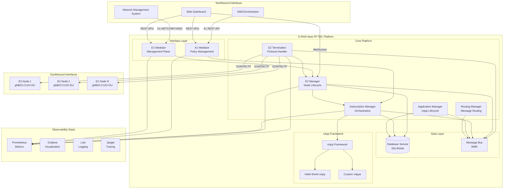

# Design Document

## Overview

This design document outlines the architecture for migrating the O-RAN Near-RT RIC project from its current ONOS-based implementation to a fully compliant O-RAN SC (Software Community) reference architecture. The design addresses the critical gaps identified in the current 39.2/100 scoring implementation and provides a roadmap to achieve production-grade O-RAN standards compliance.

The new architecture will be built on proven O-RAN SC components, implementing all three critical interfaces (E2, A1, O1) with proper protocol support, and providing a modern web-based operational interface for network management and monitoring.

## Architecture

### High-Level Architecture



### Component Architecture

The architecture is based on O-RAN SC reference implementation with the following core components:

1. **E2 Termination (E2T)**: Handles E2AP protocol, ASN.1 PER encoding, SCTP transport
2. **E2 Manager (E2M)**: Manages E2 node lifecycle, setup procedures, configuration
3. **Subscription Manager (SubMgr)**: Orchestrates E2 subscriptions, manages lifecycle
4. **A1 Mediator**: Implements A1 interface for policy management
5. **O1 Mediator**: Implements O1 interface for management plane operations
6. **xApp Framework**: Provides application development and runtime environment

## Components and Interfaces

### E2 Interface Implementation

#### E2 Termination (E2T) Component

**Purpose**: Protocol termination point for E2AP messages with ASN.1 PER encoding and SCTP transport.

**Key Features**:
- ASN.1 PER encoding/decoding for all E2AP messages
- SCTP multi-stream transport with proper stream management
- E2AP procedure implementations (Setup, Configuration Update, Reset)
- Service model registration and capability advertisement
- Message routing to appropriate platform components

**Technical Specifications**:
```yaml
Component: ric-plt/e2
Version: 4.4.6+
Protocol: E2AP v2.0 per O-RAN.WG3.E2AP-R003
Transport: SCTP multi-stream
Encoding: ASN.1 PER (Packed Encoding Rules)
Service Models: E2SM-KPM v2.0, E2SM-RC v1.0, E2SM-NI v1.0
```

**Interface Specifications**:
- **Southbound**: SCTP connections to E2 nodes (port 36422)
- **Northbound**: RMR messaging to E2M and SubMgr
- **Management**: REST API for configuration and status

#### E2 Manager (E2M) Component

**Purpose**: Manages E2 node lifecycle, connection state, and configuration management.

**Key Features**:
- E2 Setup procedure orchestration
- Node state management and health monitoring
- Configuration update handling
- Service model capability management
- Integration with topology service

**Technical Specifications**:
```yaml
Component: ric-plt/e2mgr
Version: 5.4.15+
Database: Redis/SDL for state persistence
APIs: REST API for node management
Messaging: RMR for inter-component communication
```

#### Subscription Manager (SubMgr) Component

**Purpose**: Orchestrates E2 subscriptions between xApps and E2 nodes.

**Key Features**:
- Subscription request validation and routing
- Subscription lifecycle management
- Indication distribution to xApps
- Subscription conflict resolution
- Performance monitoring and optimization

**Technical Specifications**:
```yaml
Component: ric-plt/submgr
Version: 1.8.3+
Subscription Types: Report, Insert, Policy
Load Balancing: Round-robin indication distribution
Retry Logic: Configurable retry with exponential backoff
```

### A1 Interface Implementation

#### A1 Mediator Component

**Purpose**: Implements A1 interface for policy management between SMO and near-RT RIC.

**Key Features**:
- REST API per O-RAN.WG2.A1 specifications
- Policy type registration and validation
- Policy instance lifecycle management
- JWT-based authentication with RBAC
- Policy conflict detection and resolution

**Technical Specifications**:
```yaml
Component: ric-plt/a1
Version: 2.7.1+
API Version: A1 v2.1.0
Authentication: JWT with RS256 signing
Authorization: RBAC with configurable roles
Database: Redis for policy storage
```

**API Endpoints**:
```
GET    /a1-p/healthcheck
GET    /a1-p/policytypes
POST   /a1-p/policytypes/{policy_type_id}
GET    /a1-p/policytypes/{policy_type_id}
DELETE /a1-p/policytypes/{policy_type_id}
GET    /a1-p/policytypes/{policy_type_id}/policies
PUT    /a1-p/policytypes/{policy_type_id}/policies/{policy_instance_id}
GET    /a1-p/policytypes/{policy_type_id}/policies/{policy_instance_id}
DELETE /a1-p/policytypes/{policy_type_id}/policies/{policy_instance_id}
GET    /a1-p/policytypes/{policy_type_id}/policies/{policy_instance_id}/status
```

### O1 Interface Implementation

#### O1 Mediator Component

**Purpose**: Implements O1 interface for management plane operations using NETCONF/YANG.

**Key Features**:
- NETCONF server implementation per RFC 6241
- O-RAN YANG model support
- FCAPS functionality (Fault, Configuration, Accounting, Performance, Security)
- Certificate management and secure communications
- Configuration backup and restore

**Technical Specifications**:
```yaml
Component: ric-plt/o1
Version: 1.0.0+
Protocol: NETCONF 1.1 (RFC 6241)
Models: O-RAN YANG models per WG4 specifications
Transport: SSH (port 830) and TLS (port 6513)
Capabilities: :base:1.1, :startup:1.0, :candidate:1.0, :validate:1.1
```

**YANG Model Support**:
- o-ran-sc-ric-gnb-status-v1.0.0
- o-ran-sc-ric-xapp-desc-v1.0.0
- o-ran-sc-ric-alarm-v1.0.0
- o-ran-sc-ric-kpi-v1.0.0

### xApp Framework Migration

#### xApp Framework Component

**Purpose**: Provides application development and runtime environment for intelligent RAN applications.

**Key Features**:
- Service model-specific APIs
- Subscription management integration
- RIC platform service discovery
- Hot deployment and version management
- Resource management and isolation

**Technical Specifications**:
```yaml
Component: ric-plt/xapp-frame
Language Support: Go, Python, C++
Service Models: KPM, RC, NI with extensible framework
Deployment: Kubernetes with Helm charts
Communication: RMR messaging with platform components
```

**Framework APIs**:
```go
// E2 Subscription API
type SubscriptionAPI interface {
    Subscribe(nodeID string, spec SubscriptionSpec) (SubscriptionID, error)
    Unsubscribe(subID SubscriptionID) error
    GetIndications() <-chan Indication
}

// RIC Control API
type ControlAPI interface {
    SendControl(nodeID string, controlMsg ControlMessage) error
    GetControlAck() <-chan ControlAck
}

// Platform Services API
type PlatformAPI interface {
    GetNodeList() ([]E2Node, error)
    GetNodeStatus(nodeID string) (NodeStatus, error)
    RegisterService(service ServiceDescriptor) error
}
```

## Data Models

### E2 Node Data Model

```go
type E2Node struct {
    ID                string                 `json:"id"`
    GlobalE2NodeID    GlobalE2NodeID        `json:"globalE2NodeId"`
    ConnectionStatus  ConnectionStatus       `json:"connectionStatus"`
    SetupRequest      E2SetupRequest        `json:"setupRequest"`
    ServiceModels     []ServiceModel        `json:"serviceModels"`
    RANFunctions      []RANFunction         `json:"ranFunctions"`
    LastUpdate        time.Time             `json:"lastUpdate"`
    Subscriptions     []SubscriptionInfo    `json:"subscriptions"`
}

type ServiceModel struct {
    OID           string            `json:"oid"`
    Name          string            `json:"name"`
    Version       string            `json:"version"`
    Functions     []RANFunction     `json:"functions"`
}

type RANFunction struct {
    ID            uint32            `json:"id"`
    OID           string            `json:"oid"`
    Definition    []byte            `json:"definition"`
    Revision      uint32            `json:"revision"`
}
```

### Subscription Data Model

```go
type Subscription struct {
    ID               SubscriptionID        `json:"id"`
    E2NodeID         string               `json:"e2NodeId"`
    XAppID           string               `json:"xappId"`
    RANFunctionID    uint32               `json:"ranFunctionId"`
    EventTrigger     EventTrigger         `json:"eventTrigger"`
    Actions          []Action             `json:"actions"`
    Status           SubscriptionStatus   `json:"status"`
    CreatedAt        time.Time            `json:"createdAt"`
    UpdatedAt        time.Time            `json:"updatedAt"`
}

type EventTrigger struct {
    Type             EventTriggerType     `json:"type"`
    Definition       []byte               `json:"definition"`
    Period           *time.Duration       `json:"period,omitempty"`
}

type Action struct {
    ID               uint32               `json:"id"`
    Type             ActionType           `json:"type"`
    Definition       []byte               `json:"definition"`
    SubsequentAction *SubsequentAction    `json:"subsequentAction,omitempty"`
}
```

### Policy Data Model

```go
type PolicyType struct {
    ID               string               `json:"policy_type_id"`
    Name             string               `json:"name"`
    Description      string               `json:"description"`
    Schema           json.RawMessage      `json:"policy_type_schema"`
    CreatedAt        time.Time            `json:"created_at"`
}

type PolicyInstance struct {
    ID               string               `json:"policy_instance_id"`
    TypeID           string               `json:"policy_type_id"`
    Policy           json.RawMessage      `json:"policy"`
    Status           PolicyStatus         `json:"status"`
    CreatedAt        time.Time            `json:"created_at"`
    UpdatedAt        time.Time            `json:"updated_at"`
}

type PolicyStatus struct {
    Status           string               `json:"status"`
    Reason           string               `json:"reason,omitempty"`
    LastUpdate       time.Time            `json:"last_update"`
}
```

## Error Handling

### E2 Interface Error Handling

**Connection Errors**:
- SCTP connection failures with automatic retry logic
- E2 Setup procedure failures with detailed error reporting
- Node disconnection handling with subscription cleanup

**Protocol Errors**:
- ASN.1 encoding/decoding error handling with detailed logging
- E2AP procedure error responses with proper cause codes
- Service model validation errors with descriptive messages

**Subscription Errors**:
- Subscription request validation with detailed error responses
- RAN function unavailability handling with fallback mechanisms
- Indication processing errors with retry and dead letter queues

### A1 Interface Error Handling

**Authentication Errors**:
- JWT token validation with proper HTTP status codes
- RBAC authorization failures with detailed error messages
- Certificate validation errors with secure error reporting

**Policy Errors**:
- Policy type validation against JSON schema
- Policy instance validation with detailed field-level errors
- Policy conflict detection with resolution recommendations

### O1 Interface Error Handling

**NETCONF Errors**:
- NETCONF protocol errors per RFC 6241 specifications
- YANG model validation errors with XPath references
- Configuration transaction failures with rollback support

**Management Errors**:
- FCAPS operation failures with detailed error reporting
- Certificate management errors with security event logging
- Configuration backup/restore errors with integrity validation

## Testing Strategy

### Unit Testing

**Component-Level Testing**:
- E2T: ASN.1 encoding/decoding, SCTP connection handling, message routing
- E2M: Node lifecycle management, setup procedures, state transitions
- SubMgr: Subscription validation, lifecycle management, indication routing
- A1: REST API endpoints, policy validation, authentication/authorization
- O1: NETCONF operations, YANG validation, FCAPS functionality

**Test Coverage Requirements**:
- Minimum 80% code coverage for all components
- 100% coverage for critical protocol handling functions
- Comprehensive error path testing with fault injection

### Integration Testing

**Inter-Component Testing**:
- E2T ↔ E2M: Message routing and node state synchronization
- E2M ↔ SubMgr: Subscription orchestration and node availability
- SubMgr ↔ xApp Framework: Subscription lifecycle and indication delivery
- A1 ↔ xApp Framework: Policy distribution and status reporting

**Protocol Testing**:
- E2AP conformance testing with ASN.1 message validation
- A1 REST API testing with OpenAPI specification validation
- O1 NETCONF testing with YANG model validation

### End-to-End Testing

**Scenario Testing**:
- Complete E2 node onboarding and subscription lifecycle
- Policy creation, distribution, and enforcement workflows
- Management operations through O1 interface
- xApp deployment and operational scenarios

**Performance Testing**:
- Load testing with 100+ concurrent E2 nodes
- Throughput testing with 10,000+ indications per second
- Latency testing with sub-10ms processing requirements
- Stress testing with resource exhaustion scenarios

### Compliance Testing

**Standards Validation**:
- O-RAN.WG3.E2AP-R003 compliance validation
- O-RAN.WG2.A1 specification conformance testing
- RFC 6241 NETCONF compliance validation
- O-RAN security specification compliance

**Interoperability Testing**:
- Testing with multiple E2 node implementations
- Integration with third-party SMO systems
- Compatibility with O-RAN SC ecosystem components

This comprehensive design provides the foundation for implementing a fully compliant O-RAN Near-RT RIC platform that addresses all identified technical gaps and meets production-grade requirements.