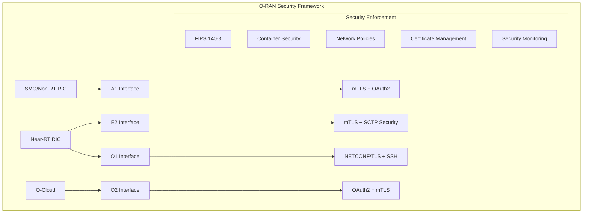

# O-RAN WG11 Security Implementation Guide
## Comprehensive Security Compliance for O-RAN L Release

### Overview

This document provides complete implementation details for O-RAN WG11 security compliance in our O-RAN L Release deployment. Our implementation includes FIPS 140-3 enforcement, container security hardening, zero-trust networking, and comprehensive security monitoring.

## Table of Contents

1. [Security Architecture](#security-architecture)
2. [WG11 Interface Security](#wg11-interface-security)
3. [FIPS 140-3 Compliance](#fips-140-3-compliance)
4. [Container Security](#container-security)
5. [Network Security](#network-security)
6. [Security Testing](#security-testing)
7. [Deployment Guide](#deployment-guide)
8. [Monitoring and Alerting](#monitoring-and-alerting)
9. [Compliance Verification](#compliance-verification)

## Security Architecture

### Components Overview



### Security Layers

1. **Transport Security**: mTLS encryption for all interfaces
2. **Authentication**: X.509 certificates, OAuth2, SSH keys
3. **Authorization**: RBAC, NETCONF ACM
4. **Network Security**: Zero-trust policies, service mesh
5. **Container Security**: Pod Security Standards, runtime protection
6. **Cryptographic Compliance**: FIPS 140-3 enforcement

## WG11 Interface Security

### E2 Interface Security

The E2 interface connects the Near-RT RIC with E2 nodes (gNBs/eNBs) using SCTP transport with enhanced security:

**Configuration:**
```yaml
# E2 Interface Security Policy
apiVersion: security.o-ran.org/v1alpha1
kind: SecurityPolicy
metadata:
  name: e2-interface-security
spec:
  interface: e2
  mtls:
    enabled: true
    minTLSVersion: "1.3"
    cipherSuites:
      - TLS_AES_128_GCM_SHA256
      - TLS_AES_256_GCM_SHA384
      - TLS_CHACHA20_POLY1305_SHA256
  encryption:
    algorithm: AES-256-GCM
    keyRotation: 12h
  authentication:
    type: x509-certificate
    requireSigning: true
```

**Security Features:**
- Mutual TLS authentication
- Certificate-based identity verification
- OCSP certificate validation
- 12-hour key rotation
- AES-256-GCM encryption
- Integrity verification with HMAC-SHA256

### A1 Interface Security

The A1 interface enables policy management between SMO and Near-RT RIC:

**Configuration:**
```yaml
# A1 Interface Security Policy
apiVersion: security.o-ran.org/v1alpha1
kind: SecurityPolicy
metadata:
  name: a1-interface-security
spec:
  interface: a1
  authentication:
    type: oauth2
    issuerUrl: https://keycloak.oran.local/auth/realms/oran
    scopes: [policy:read, policy:write, policy:delete]
  authorization:
    type: rbac
    roles:
      - name: policy-admin
        permissions: [create, read, update, delete]
      - name: policy-viewer
        permissions: [read]
```

**Security Features:**
- OAuth2/OIDC authentication
- JWT token validation
- Role-based access control
- Rate limiting (1000 req/min)
- TLS 1.3 transport encryption
- Comprehensive audit logging

### O1 Interface Security

The O1 interface provides configuration management via NETCONF/YANG:

**Configuration:**
```yaml
# O1 Interface Security Policy
apiVersion: security.o-ran.org/v1alpha1
kind: SecurityPolicy
metadata:
  name: o1-interface-security
spec:
  interface: o1
  netconf:
    tls:
      enabled: true
      port: 6513
      minTLSVersion: "1.3"
    ssh:
      enabled: true
      port: 830
      keyExchange: [curve25519-sha256]
  accessControl:
    enabled: true
    nacp:
      enableNacp: true
      readDefault: deny
      writeDefault: deny
      execDefault: deny
```

**Security Features:**
- NETCONF over TLS (port 6513)
- NETCONF over SSH (port 830)
- NETCONF Access Control Model (NACM)
- Strong key exchange algorithms
- Curve25519 cryptography
- Default deny access policy

### O2 Interface Security

The O2 interface manages O-Cloud resources and subscriptions:

**Configuration:**
```yaml
# O2 Interface Security Policy
apiVersion: security.o-ran.org/v1alpha1
kind: SecurityPolicy
metadata:
  name: o2-interface-security
spec:
  interface: o2
  ocloud:
    authentication:
      type: oauth2
      scopes: [resource:read, resource:write, subscription:manage]
    transport:
      mtls:
        enabled: true
        minTLSVersion: "1.3"
    resourcePool:
      security:
        isolation: true
        encryption: true
        keyManagement: vault
```

**Security Features:**
- OAuth2 authentication for DMS
- Mutual TLS transport
- Resource pool isolation
- Subscription authentication
- Vault key management
- Signature verification for resources

## FIPS 140-3 Compliance

### Go 1.25 FIPS Implementation

Our implementation uses Go 1.25+ with strict FIPS 140-3 compliance:

**Build Configuration:**
```bash
# FIPS build flags
FIPS_MODE=only
FIPS_FLAGS="-tags=fips -ldflags=-X crypto/tls/fipsonly.fipsOnly=true"

# Environment variables
GODEBUG=fips140=only
OPENSSL_FIPS=1
GOFIPS=1
CGO_ENABLED=1
```

**Makefile Integration:**
```make
build-fips: setup-dirs deps
	@export GODEBUG=fips140=$(FIPS_MODE) OPENSSL_FIPS=1 GOFIPS=1 CGO_ENABLED=1; \
	for binary in $(BINARIES); do \
		CGO_ENABLED=$(CGO_ENABLED) GOOS=$(GOOS) GOARCH=$(GOARCH) \
		$(GO) build $(GOFLAGS) $(FIPS_FLAGS) $(LDFLAGS) -o $(BIN_DIR)/$$binary ./cmd/$$binary; \
	done
```

### FIPS Compliance Verification

**Runtime Verification:**
```bash
# Check FIPS mode in running containers
kubectl exec -n oran deployment/ric -- sh -c 'echo $GODEBUG | grep fips140=only'

# Verify cryptographic operations
kubectl exec -n oran deployment/ric -- go run -tags=fips fips_test.go
```

**Compliance Requirements:**
- All cryptographic operations use FIPS 140-3 approved algorithms
- Key generation uses FIPS-approved random number generators
- TLS connections use only FIPS-approved cipher suites
- Digital signatures use approved algorithms (RSA, ECDSA)
- Hash functions limited to SHA-2 family

## Container Security

### Pod Security Standards

All pods run with restricted security contexts:

**Security Context:**
```yaml
securityContext:
  runAsNonRoot: true
  runAsUser: 10001
  runAsGroup: 10001
  fsGroup: 10001
  seccompProfile:
    type: RuntimeDefault
  seLinuxOptions:
    level: "s0:c123,c456"

containers:
- securityContext:
    readOnlyRootFilesystem: true
    allowPrivilegeEscalation: false
    capabilities:
      drop: [ALL]
      add: [NET_BIND_SERVICE]
```

### Container Image Scanning

**Trivy Integration:**
```bash
# Scan all container images
make security-scan-containers

# Example scan command
trivy image --severity HIGH,CRITICAL \
  --format json --output coverage/scan.json \
  oran-sc/dashboard-api:latest
```

**Scan Policy:**
- Maximum 0 critical vulnerabilities
- Maximum 5 high-severity vulnerabilities
- Automatic scanning in CI/CD pipeline
- Regular base image updates

## Network Security

### Zero-Trust Architecture

**Default Deny Policy:**
```yaml
apiVersion: networking.k8s.io/v1
kind: NetworkPolicy
metadata:
  name: zero-trust-default-deny
spec:
  podSelector: {}
  policyTypes: [Ingress, Egress]
  # No rules = deny all
```

**Interface-Specific Policies:**
```yaml
# E2 Interface Network Policy
apiVersion: networking.k8s.io/v1
kind: NetworkPolicy
metadata:
  name: oran-e2-interface-policy
spec:
  podSelector:
    matchLabels:
      interface: e2
  ingress:
  - ports:
    - protocol: SCTP
      port: 36421  # E2AP over SCTP
  - from:
    - podSelector:
        matchLabels:
          platform: oran-sc
    ports:
    - protocol: TCP
      port: 4560  # RMR data port
```

### Service Mesh Security

**Istio mTLS Configuration:**
```yaml
apiVersion: security.istio.io/v1beta1
kind: PeerAuthentication
metadata:
  name: oran-mtls-strict
spec:
  mtls:
    mode: STRICT

---
apiVersion: security.istio.io/v1beta1
kind: AuthorizationPolicy
metadata:
  name: oran-authz-policy
spec:
  rules:
  - from:
    - source:
        principals: ["cluster.local/ns/oran/sa/e2term-sa"]
    when:
    - key: source.certificate_fingerprint
      values: ["sha256:*"]
```

## Security Testing

### Automated Security Tests

**Test Categories:**

1. **WG11 Interface Tests**
   ```bash
   make security-test interfaces
   ```
   - Verify security policies exist
   - Test mTLS configuration
   - Validate certificate management
   - Check encryption settings

2. **FIPS Compliance Tests**
   ```bash
   make security-test fips
   ```
   - Verify FIPS environment variables
   - Test cryptographic operations
   - Check approved algorithms only
   - Validate key generation

3. **Container Security Tests**
   ```bash
   make security-test containers
   ```
   - Check security contexts
   - Verify non-root execution
   - Test capability restrictions
   - Validate image scanning

4. **Network Security Tests**
   ```bash
   make security-test network
   ```
   - Verify network policies
   - Test zero-trust enforcement
   - Check service mesh mTLS
   - Validate traffic isolation

### Penetration Testing

**Security Assessment:**
```bash
# Run comprehensive security tests
make security-test pentest
```

**Test Coverage:**
- Privileged container detection
- Root user verification
- Capability analysis
- Host network usage
- Security policy validation

## Deployment Guide

### Quick Start

1. **Prerequisites:**
   ```bash
   # Install security tools
   make install-security-tools
   
   # Verify Go version (requires 1.25+)
   go version
   ```

2. **Apply Security Configuration:**
   ```bash
   # Full security enforcement
   make security-enforce
   
   # Or step-by-step:
   make security-certs    # Generate certificates
   make security-fips     # Configure FIPS
   make security-network  # Apply network policies
   ```

3. **Deploy with Security:**
   ```bash
   # Build with FIPS compliance
   make build-fips
   
   # Deploy to Kubernetes
   make deploy-local
   ```

4. **Verify Security:**
   ```bash
   # Run all security tests
   make security-test
   
   # Generate compliance report
   make security-verify
   ```

### Production Deployment

**Step-by-Step Process:**

1. **Environment Preparation:**
   ```bash
   # Set up secure namespaces
   kubectl apply -f config/oran-wg11-security.yaml
   
   # Verify prerequisites
   ./scripts/oran-security-enforcement.sh prereq
   ```

2. **Certificate Management:**
   ```bash
   # Generate interface certificates
   ./scripts/oran-security-enforcement.sh certs
   
   # Verify certificate validity
   kubectl get secrets -A | grep tls
   ```

3. **FIPS Configuration:**
   ```bash
   # Configure FIPS for all deployments
   ./scripts/oran-security-enforcement.sh fips
   
   # Verify FIPS settings
   kubectl get pods -A -o json | jq '.items[].spec.containers[].env[]? | select(.name=="GODEBUG")'
   ```

4. **Network Security:**
   ```bash
   # Apply zero-trust policies
   ./scripts/oran-security-enforcement.sh network
   
   # Verify network policies
   kubectl get networkpolicies -A
   ```

5. **Validation:**
   ```bash
   # Complete security validation
   ./scripts/security-validation-tests.sh full
   
   # Generate compliance report
   ./scripts/oran-security-enforcement.sh verify
   ```

## Monitoring and Alerting

### Security Metrics

**Prometheus Rules:**
```yaml
groups:
- name: oran-security-alerts
  rules:
  - alert: TLSCertificateExpiring
    expr: (probe_ssl_earliest_cert_expiry - time()) / 86400 < 30
    labels:
      severity: warning
    annotations:
      summary: "TLS certificate expiring in {{ $value }} days"
      
  - alert: FailedAuthentication
    expr: increase(oran_authentication_failures_total[5m]) > 10
    labels:
      severity: critical
    annotations:
      summary: "High number of authentication failures detected"
```

**Security Dashboard:**
- Certificate expiration tracking
- Authentication failure rates
- Network policy violations
- Container vulnerability status
- FIPS compliance monitoring

### Audit Logging

**Configuration:**
```yaml
audit:
  enabled: true
  logLevel: INFO
  auditEvents:
    - connection_established
    - connection_terminated
    - certificate_validation
    - encryption_key_rotation
    - policy_creation
    - policy_modification
    - unauthorized_access_attempt
```

## Compliance Verification

### WG11 Compliance Checklist

- ✅ **E2 Interface**: mTLS, certificate validation, AES-256-GCM encryption
- ✅ **A1 Interface**: OAuth2, RBAC, TLS 1.3 transport
- ✅ **O1 Interface**: NETCONF/TLS, SSH, NACM access control
- ✅ **O2 Interface**: OAuth2, mTLS, resource isolation
- ✅ **FIPS 140-3**: Go 1.25+ with "only" mode, approved algorithms
- ✅ **Container Security**: Pod Security Standards, non-root execution
- ✅ **Network Security**: Zero-trust policies, service mesh mTLS
- ✅ **Certificate Management**: X.509 certificates, automated rotation
- ✅ **Security Monitoring**: Prometheus metrics, audit logging
- ✅ **Vulnerability Management**: Trivy scanning, automated patching

### Compliance Report

**Generated Report Structure:**
```yaml
security_compliance_report:
  timestamp: 2025-01-06T10:30:00Z
  o_ran_release: L
  wg11_compliance_version: "3.0"
  
  interfaces:
    e2: { security_policy_configured: true, tls_certificates_deployed: true }
    a1: { security_policy_configured: true, oauth2_configured: true }
    o1: { security_policy_configured: true, netconf_acm_enabled: true }
    o2: { security_policy_configured: true, resource_isolation: true }
  
  fips_140_3:
    enabled: true
    go_version: "1.25"
    compliance_percentage: 100%
  
  compliance_status:
    overall: COMPLIANT
    wg11_interfaces: COMPLIANT
    fips_140_3: COMPLIANT
    zero_trust_networking: COMPLIANT
    container_hardening: COMPLIANT
```

## Troubleshooting

### Common Issues

1. **FIPS Mode Not Enabled:**
   ```bash
   # Check environment variables
   kubectl exec -n oran deployment/ric -- printenv | grep FIPS
   
   # Re-apply FIPS configuration
   make security-fips
   ```

2. **Certificate Validation Failures:**
   ```bash
   # Check certificate validity
   kubectl get secret e2-server-cert-tls -n oran -o yaml
   
   # Regenerate certificates
   make security-certs
   ```

3. **Network Policy Blocking Traffic:**
   ```bash
   # Check network policies
   kubectl describe networkpolicy -n oran
   
   # Review policy rules
   kubectl get networkpolicy -o yaml
   ```

4. **Container Security Context Errors:**
   ```bash
   # Check pod security context
   kubectl describe pod -n oran
   
   # Verify security standards
   kubectl get namespace oran -o yaml
   ```

### Performance Considerations

- FIPS mode may impact performance by 5-10%
- mTLS adds ~2ms latency per connection
- Certificate validation requires OCSP connectivity
- Network policies may affect service discovery timing

### Maintenance Tasks

**Regular Maintenance:**
1. Certificate rotation (quarterly)
2. Security policy updates (monthly)
3. Container image updates (weekly)
4. Vulnerability scanning (daily)
5. Compliance verification (monthly)

**Automated Tasks:**
- Daily vulnerability scans
- Weekly compliance reports
- Monthly certificate health checks
- Quarterly security assessments

## Conclusion

This comprehensive O-RAN WG11 security implementation provides:

- **Complete WG11 Compliance**: All four interfaces secured according to specification
- **FIPS 140-3 Enforcement**: Strict cryptographic compliance with Go 1.25+
- **Zero-Trust Architecture**: Default deny network policies with explicit allow rules
- **Container Hardening**: Pod Security Standards with runtime protection
- **Automated Security Testing**: Comprehensive validation and compliance verification
- **Production-Ready Deployment**: Scalable, maintainable security architecture

The implementation ensures robust security for O-RAN L Release deployments while maintaining operational efficiency and compliance with industry standards.

For support and updates, refer to the security enforcement scripts and validation tools provided in the `scripts/` directory.