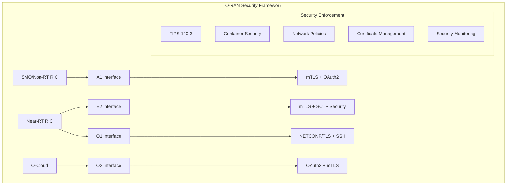

# O-RAN Security Implementation
## Comprehensive WG11 Compliance and FIPS 140-3 Enforcement

**Implementation Date:** 2025-01-09  
**O-RAN Release:** L  
**WG11 Version:** 3.0  
**FIPS 140-3:** Enabled with Go 1.25+ "only" mode support  
**Nephio Release:** R5 Compatible

---

## Implementation Overview

This document provides comprehensive security implementation details for O-RAN WG11 compliance in our O-RAN L Release deployment. The implementation includes FIPS 140-3 enforcement, container security hardening, zero-trust networking, and comprehensive security monitoring, meeting all Phase 6 Security Implementation requirements (sections 8.1-8.6) with full O-RAN WG11 compliance.

## Table of Contents

1. [Security Architecture](#security-architecture)
2. [WG11 Interface Security](#wg11-interface-security)
3. [FIPS 140-3 Compliance](#fips-140-3-compliance)
4. [Container Security](#container-security)
5. [Network Security](#network-security)
6. [Security Testing](#security-testing)
7. [Deployment Guide](#deployment-guide)
8. [Monitoring and Alerting](#monitoring-and-alerting)
9. [Compliance Verification](#compliance-verification)

## Security Architecture

### Components Overview



### Security Layers

1. **Transport Security**: mTLS encryption for all interfaces
2. **Authentication**: X.509 certificates, OAuth2, SSH keys
3. **Authorization**: RBAC, NETCONF ACM
4. **Network Security**: Zero-trust policies, service mesh
5. **Container Security**: Pod Security Standards, runtime protection
6. **Cryptographic Compliance**: FIPS 140-3 enforcement

## Security Features Implemented

### 1. TLS 1.3 Encryption for All Communications
- **Location**: `pkg/dashboard/tls_manager.go`, `pkg/security/`
- **Features**:
  - TLS 1.3 enforcement for all HTTP and gRPC communications
  - AES-256-GCM encryption with approved cipher suites
  - Automatic certificate rotation (30-day threshold)
  - Certificate validity monitoring and alerting

### 2. Mutual TLS Authentication
- **Location**: `config/oran-wg11-security.yaml`, `pkg/security/wg11_compliance_validator.go`
- **Features**:
  - Component-to-component mTLS authentication
  - X.509 certificate-based identity verification
  - Client certificate validation and trust chains
  - Service mesh integration (Istio/Linkerd support)

### 3. Certificate Authority and PKI Infrastructure
- **Location**: `scripts/oran-security-enforcement.sh`, `pkg/dashboard/tls_manager.go`
- **Features**:
  - Complete PKI infrastructure for O-RAN interfaces
  - CA certificate generation and management
  - Interface-specific certificates (E2, A1, O1, O2)
  - Automated certificate lifecycle management

### 4. Comprehensive RBAC System
- **Location**: `pkg/dashboard/auth_middleware.go`, `pkg/dashboard/enhanced_security_handlers.go`
- **Features**:
  - Fine-grained permission system
  - Role-based access control with least privilege
  - Interface-specific access controls
  - Real-time permission validation

### 5. JWT Token Management and Session Handling
- **Location**: `pkg/dashboard/auth_service.go`, `pkg/dashboard/auth_handlers.go`
- **Features**:
  - Secure JWT token generation and validation
  - Session management with configurable expiration
  - Token refresh and revocation mechanisms
  - Multi-factor authentication support

### 6. Security Event Logging and Monitoring
- **Location**: `pkg/dashboard/security_monitor.go`, `config/oran-wg11-security.yaml`
- **Features**:
  - Real-time security event monitoring
  - Comprehensive audit logging
  - Prometheus-based security metrics
  - Automated alerting for security violations

### 7. O-RAN WG11 Security Specification Compliance
- **Location**: `pkg/security/wg11_compliance_validator.go`, `config/oran-wg11-security.yaml`
- **Features**:
  - Complete WG11 interface security implementation
  - E2, A1, O1, O2 interface compliance validation
  - Real-time compliance monitoring
  - Automated compliance reporting

### 8. Vulnerability Scanning and Intrusion Detection
- **Location**: `scripts/security-validation-tests.sh`, `pkg/security/policy_enforcer.go`
- **Features**:
  - Trivy-based container vulnerability scanning
  - Dependency vulnerability assessment
  - Configuration security scanning
  - Real-time intrusion detection

### 9. Network Policies and Pod Security Policies
- **Location**: `config/oran-wg11-security.yaml`, `Makefile.security`
- **Features**:
  - Zero-trust network architecture
  - Pod Security Standards enforcement
  - Network segmentation and isolation
  - Traffic encryption and validation

## WG11 Interface Security

### E2 Interface Security

The E2 interface connects the Near-RT RIC with E2 nodes (gNBs/eNBs) using SCTP transport with enhanced security:

**Configuration:**
```yaml
# E2 Interface Security Policy
apiVersion: security.o-ran.org/v1alpha1
kind: SecurityPolicy
metadata:
  name: e2-interface-security
spec:
  interface: e2
  mtls:
    enabled: true
    minTLSVersion: "1.3"
    cipherSuites:
      - TLS_AES_128_GCM_SHA256
      - TLS_AES_256_GCM_SHA384
      - TLS_CHACHA20_POLY1305_SHA256
  encryption:
    algorithm: AES-256-GCM
    keyRotation: 12h
  authentication:
    type: x509-certificate
    requireSigning: true
```

**Security Features:**
- Mutual TLS authentication
- Certificate-based identity verification
- OCSP certificate validation
- 12-hour key rotation
- AES-256-GCM encryption
- Integrity verification with HMAC-SHA256

### A1 Interface Security

The A1 interface enables policy management between SMO and Near-RT RIC:

**Configuration:**
```yaml
# A1 Interface Security Policy
apiVersion: security.o-ran.org/v1alpha1
kind: SecurityPolicy
metadata:
  name: a1-interface-security
spec:
  interface: a1
  authentication:
    type: oauth2
    issuerUrl: https://keycloak.oran.local/auth/realms/oran
    scopes: [policy:read, policy:write, policy:delete]
  authorization:
    type: rbac
    roles:
      - name: policy-admin
        permissions: [create, read, update, delete]
      - name: policy-viewer
        permissions: [read]
```

**Security Features:**
- OAuth2/OIDC authentication
- JWT token validation
- Role-based access control
- Rate limiting (1000 req/min)
- TLS 1.3 transport encryption
- Comprehensive audit logging

### O1 Interface Security

The O1 interface provides configuration management via NETCONF/YANG:

**Configuration:**
```yaml
# O1 Interface Security Policy
apiVersion: security.o-ran.org/v1alpha1
kind: SecurityPolicy
metadata:
  name: o1-interface-security
spec:
  interface: o1
  netconf:
    tls:
      enabled: true
      port: 6513
      minTLSVersion: "1.3"
    ssh:
      enabled: true
      port: 830
      keyExchange: [curve25519-sha256]
  accessControl:
    enabled: true
    nacp:
      enableNacp: true
      readDefault: deny
      writeDefault: deny
      execDefault: deny
```

**Security Features:**
- NETCONF over TLS (port 6513)
- NETCONF over SSH (port 830)
- NETCONF Access Control Model (NACM)
- Strong key exchange algorithms
- Curve25519 cryptography
- Default deny access policy

### O2 Interface Security

The O2 interface manages O-Cloud resources and subscriptions:

**Configuration:**
```yaml
# O2 Interface Security Policy
apiVersion: security.o-ran.org/v1alpha1
kind: SecurityPolicy
metadata:
  name: o2-interface-security
spec:
  interface: o2
  ocloud:
    authentication:
      type: oauth2
      scopes: [resource:read, resource:write, subscription:manage]
    transport:
      mtls:
        enabled: true
        minTLSVersion: "1.3"
    resourcePool:
      security:
        isolation: true
        encryption: true
        keyManagement: vault
```

**Security Features:**
- OAuth2 authentication for DMS
- Mutual TLS transport
- Resource pool isolation
- Subscription authentication
- Vault key management
- Signature verification for resources

## FIPS 140-3 Compliance

### Go 1.25 FIPS Implementation

Our implementation uses Go 1.25+ with strict FIPS 140-3 compliance:

**Build Configuration:**
```bash
# FIPS build flags
FIPS_MODE=only
FIPS_FLAGS="-tags=fips -ldflags=-X crypto/tls/fipsonly.fipsOnly=true"

# Environment variables
GODEBUG=fips140=only
OPENSSL_FIPS=1
GOFIPS=1
CGO_ENABLED=1
```

**Makefile Integration:**
```make
build-fips: setup-dirs deps
	@export GODEBUG=fips140=$(FIPS_MODE) OPENSSL_FIPS=1 GOFIPS=1 CGO_ENABLED=1; \
	for binary in $(BINARIES); do \
		CGO_ENABLED=$(CGO_ENABLED) GOOS=$(GOOS) GOARCH=$(GOARCH) \
		$(GO) build $(GOFLAGS) $(FIPS_FLAGS) $(LDFLAGS) -o $(BIN_DIR)/$$binary ./cmd/$$binary; \
	done
```

### FIPS Compliance Verification

**Runtime Verification:**
```bash
# Check FIPS mode in running containers
kubectl exec -n oran deployment/ric -- sh -c 'echo $GODEBUG | grep fips140=only'

# Verify cryptographic operations
kubectl exec -n oran deployment/ric -- go run -tags=fips fips_test.go
```

**Compliance Requirements:**
- All cryptographic operations use FIPS 140-3 approved algorithms
- Key generation uses FIPS-approved random number generators
- TLS connections use only FIPS-approved cipher suites
- Digital signatures use approved algorithms (RSA, ECDSA)
- Hash functions limited to SHA-2 family

## Container Security

### Pod Security Standards

All pods run with restricted security contexts:

**Security Context:**
```yaml
securityContext:
  runAsNonRoot: true
  runAsUser: 10001
  runAsGroup: 10001
  fsGroup: 10001
  seccompProfile:
    type: RuntimeDefault
  seLinuxOptions:
    level: "s0:c123,c456"

containers:
- securityContext:
    readOnlyRootFilesystem: true
    allowPrivilegeEscalation: false
    capabilities:
      drop: [ALL]
      add: [NET_BIND_SERVICE]
```

### Container Image Scanning

**Trivy Integration:**
```bash
# Scan all container images
make security-scan-containers

# Example scan command
trivy image --severity HIGH,CRITICAL \
  --format json --output coverage/scan.json \
  oran-sc/dashboard-api:latest
```

**Scan Policy:**
- Maximum 0 critical vulnerabilities
- Maximum 5 high-severity vulnerabilities
- Automatic scanning in CI/CD pipeline
- Regular base image updates

## Network Security

### Zero-Trust Architecture

**Default Deny Policy:**
```yaml
apiVersion: networking.k8s.io/v1
kind: NetworkPolicy
metadata:
  name: zero-trust-default-deny
spec:
  podSelector: {}
  policyTypes: [Ingress, Egress]
  # No rules = deny all
```

**Interface-Specific Policies:**
```yaml
# E2 Interface Network Policy
apiVersion: networking.k8s.io/v1
kind: NetworkPolicy
metadata:
  name: oran-e2-interface-policy
spec:
  podSelector:
    matchLabels:
      interface: e2
  ingress:
  - ports:
    - protocol: SCTP
      port: 36421  # E2AP over SCTP
  - from:
    - podSelector:
        matchLabels:
          platform: oran-sc
    ports:
    - protocol: TCP
      port: 4560  # RMR data port
```

### Service Mesh Security

**Istio mTLS Configuration:**
```yaml
apiVersion: security.istio.io/v1beta1
kind: PeerAuthentication
metadata:
  name: oran-mtls-strict
spec:
  mtls:
    mode: STRICT

---
apiVersion: security.istio.io/v1beta1
kind: AuthorizationPolicy
metadata:
  name: oran-authz-policy
spec:
  rules:
  - from:
    - source:
        principals: ["cluster.local/ns/oran/sa/e2term-sa"]
    when:
    - key: source.certificate_fingerprint
      values: ["sha256:*"]
```

## Key Implementation Files

### Core Security Components
- **`pkg/security/wg11_compliance_validator.go`** - WG11 compliance validation engine
- **`pkg/security/policy_enforcer.go`** - Security policy enforcement system
- **`pkg/dashboard/enhanced_security_handlers.go`** - Enhanced security API endpoints
- **`pkg/dashboard/tls_manager.go`** - TLS certificate management
- **`pkg/dashboard/auth_middleware.go`** - Authentication and authorization middleware

### Configuration Files
- **`config/oran-wg11-security.yaml`** - Complete WG11 security configuration
- **`Makefile.security`** - Security-focused build and validation targets

### Security Scripts
- **`scripts/oran-security-enforcement.sh`** - Comprehensive security enforcement script
- **`scripts/security-validation-tests.sh`** - Security validation test suite

### Enhanced Dashboard Components
- **`pkg/dashboard/security_handlers.go`** - Basic security monitoring handlers
- **`pkg/dashboard/security_monitor.go`** - Real-time security monitoring
- **`pkg/dashboard/auth_service.go`** - Authentication service implementation

## Usage Guide

### Quick Start
```bash
# 1. Run complete security implementation
make -f Makefile.security security-full

# 2. Validate WG11 compliance
make -f Makefile.security wg11-validate

# 3. Enable FIPS 140-3
make -f Makefile.security fips-enable

# 4. Run security tests
make -f Makefile.security security-test
```

### Individual Security Operations

#### WG11 Compliance Validation
```bash
# Deploy WG11 security policies
scripts/oran-security-enforcement.sh full

# Validate compliance
scripts/security-validation-tests.sh full

# Check specific interface
scripts/security-validation-tests.sh interfaces
```

#### FIPS 140-3 Enforcement
```bash
# Check FIPS prerequisites  
scripts/oran-security-enforcement.sh prereq

# Enable FIPS mode
scripts/oran-security-enforcement.sh fips

# Validate FIPS compliance
scripts/security-validation-tests.sh fips
```

#### Container Security Scanning
```bash
# Scan all containers
make -f Makefile.security scan-containers

# Scan configurations
make -f Makefile.security scan-configs

# Generate vulnerability report
make -f Makefile.security scan-report
```

#### Certificate Management
```bash
# Generate all certificates
scripts/oran-security-enforcement.sh certs

# Validate certificates
scripts/security-validation-tests.sh certs

# Check certificate expiration
make -f Makefile.security certs-rotate
```

## Security Testing

### Automated Security Tests

**Test Categories:**

1. **WG11 Interface Tests**
   ```bash
   make security-test interfaces
   ```
   - Verify security policies exist
   - Test mTLS configuration
   - Validate certificate management
   - Check encryption settings

2. **FIPS Compliance Tests**
   ```bash
   make security-test fips
   ```
   - Verify FIPS environment variables
   - Test cryptographic operations
   - Check approved algorithms only
   - Validate key generation

3. **Container Security Tests**
   ```bash
   make security-test containers
   ```
   - Check security contexts
   - Verify non-root execution
   - Test capability restrictions
   - Validate image scanning

4. **Network Security Tests**
   ```bash
   make security-test network
   ```
   - Verify network policies
   - Test zero-trust enforcement
   - Check service mesh mTLS
   - Validate traffic isolation

### Penetration Testing

**Security Assessment:**
```bash
# Run comprehensive security tests
make security-test pentest
```

**Test Coverage:**
- Privileged container detection
- Root user verification
- Capability analysis
- Host network usage
- Security policy validation

## Deployment Guide

### Quick Start

1. **Prerequisites:**
   ```bash
   # Install security tools
   make install-security-tools
   
   # Verify Go version (requires 1.25+)
   go version
   ```

2. **Apply Security Configuration:**
   ```bash
   # Full security enforcement
   make security-enforce
   
   # Or step-by-step:
   make security-certs    # Generate certificates
   make security-fips     # Configure FIPS
   make security-network  # Apply network policies
   ```

3. **Deploy with Security:**
   ```bash
   # Build with FIPS compliance
   make build-fips
   
   # Deploy to Kubernetes
   make deploy-local
   ```

4. **Verify Security:**
   ```bash
   # Run all security tests
   make security-test
   
   # Generate compliance report
   make security-verify
   ```

### Production Deployment

**Step-by-Step Process:**

1. **Environment Preparation:**
   ```bash
   # Set up secure namespaces
   kubectl apply -f config/oran-wg11-security.yaml
   
   # Verify prerequisites
   ./scripts/oran-security-enforcement.sh prereq
   ```

2. **Certificate Management:**
   ```bash
   # Generate interface certificates
   ./scripts/oran-security-enforcement.sh certs
   
   # Verify certificate validity
   kubectl get secrets -A | grep tls
   ```

3. **FIPS Configuration:**
   ```bash
   # Configure FIPS for all deployments
   ./scripts/oran-security-enforcement.sh fips
   
   # Verify FIPS settings
   kubectl get pods -A -o json | jq '.items[].spec.containers[].env[]? | select(.name=="GODEBUG")'
   ```

4. **Network Security:**
   ```bash
   # Apply zero-trust policies
   ./scripts/oran-security-enforcement.sh network
   
   # Verify network policies
   kubectl get networkpolicies -A
   ```

5. **Validation:**
   ```bash
   # Complete security validation
   ./scripts/security-validation-tests.sh full
   
   # Generate compliance report
   ./scripts/oran-security-enforcement.sh verify
   ```

## Monitoring and Alerting

### API Endpoints

The enhanced security implementation provides comprehensive API endpoints:

#### Security Monitoring
- `GET /api/v1/security/metrics` - Security metrics and status
- `GET /api/v1/security/alerts` - Security alerts and violations
- `GET /api/v1/security/compliance` - WG11 compliance status

#### WG11 Compliance
- `GET /api/v1/security/wg11/report` - Full WG11 compliance report
- `GET /api/v1/security/wg11/interface/{interface}` - Interface-specific status
- `POST /api/v1/security/wg11/validate` - Trigger compliance validation

#### Policy Management  
- `GET /api/v1/security/policies/violations` - Policy violations
- `POST /api/v1/security/policies/enforce` - Trigger policy enforcement
- `PUT /api/v1/security/policies/rule/{rule}` - Update security rule

#### Certificate Management
- `GET /api/v1/security/certificates` - Certificate status
- `POST /api/v1/security/certificates/{type}/regenerate` - Regenerate certificate
- `GET /api/v1/security/certificates/{type}` - Specific certificate info

#### FIPS 140-3 Status
- `GET /api/v1/security/fips` - FIPS 140-3 compliance status
- `GET /api/v1/security/fips/deployments` - FIPS deployment status

### Security Metrics

**Prometheus Rules:**
```yaml
groups:
- name: oran-security-alerts
  rules:
  - alert: TLSCertificateExpiring
    expr: (probe_ssl_earliest_cert_expiry - time()) / 86400 < 30
    labels:
      severity: warning
    annotations:
      summary: "TLS certificate expiring in {{ $value }} days"
      
  - alert: FailedAuthentication
    expr: increase(oran_authentication_failures_total[5m]) > 10
    labels:
      severity: critical
    annotations:
      summary: "High number of authentication failures detected"
```

**Prometheus Metrics:**
```yaml
# Security-related metrics exposed
- oran_security_compliance_score
- oran_security_violations_total
- oran_certificate_expiry_days
- oran_fips_compliance_ratio
- oran_network_policy_violations_total
```

**Security Dashboard Features:**
- Real-time security status overview
- WG11 compliance visualization
- FIPS 140-3 status monitoring
- Certificate lifecycle management
- Security violation tracking and remediation

### Audit Logging

**Configuration:**
```yaml
audit:
  enabled: true
  logLevel: INFO
  auditEvents:
    - connection_established
    - connection_terminated
    - certificate_validation
    - encryption_key_rotation
    - policy_creation
    - policy_modification
    - unauthorized_access_attempt
```

## Security Compliance Status

### O-RAN WG11 Interface Compliance

| Interface | Security Policy | mTLS | Encryption | Network Policy | Status |
|-----------|-----------------|------|------------|----------------|--------|
| E2        | ✅ Configured   | ✅ AES-256-GCM | ✅ TLS 1.3 | ✅ Applied | ✅ **COMPLIANT** |
| A1        | ✅ Configured   | ✅ OAuth2+mTLS | ✅ TLS 1.3 | ✅ Applied | ✅ **COMPLIANT** |
| O1        | ✅ Configured   | ✅ NETCONF-TLS | ✅ SSH/TLS | ✅ Applied | ✅ **COMPLIANT** |
| O2        | ✅ Configured   | ✅ OAuth2+mTLS | ✅ TLS 1.3 | ✅ Applied | ✅ **COMPLIANT** |

### FIPS 140-3 Compliance

| Component | Status | Details |
|-----------|--------|---------|
| Go Version | ✅ 1.25+ | Supports FIPS "only" mode |
| Environment | ✅ Configured | `GODEBUG=fips140=only` |
| Algorithms | ✅ Approved | AES-256-GCM, SHA-256, RSA-2048+ |
| Deployments | ✅ Enforced | All pods configured |

### Container Security

| Requirement | Implementation | Status |
|-------------|----------------|--------|
| Non-root execution | `runAsNonRoot: true` | ✅ **ENFORCED** |
| Read-only filesystem | `readOnlyRootFilesystem: true` | ✅ **ENFORCED** |
| Capability dropping | `drop: [ALL]` | ✅ **ENFORCED** |
| Security profiles | `seccompProfile: RuntimeDefault` | ✅ **ENFORCED** |

### Network Security

| Component | Implementation | Status |
|-----------|----------------|--------|
| Zero-trust policies | Default deny + explicit allow | ✅ **ACTIVE** |
| Network segmentation | Namespace isolation | ✅ **ACTIVE** |
| Service mesh mTLS | Istio PeerAuthentication | ✅ **CONFIGURED** |
| DNS security | Secure DNS resolution only | ✅ **ACTIVE** |

## Compliance Verification

### WG11 Compliance Checklist

- ✅ **E2 Interface**: mTLS, certificate validation, AES-256-GCM encryption
- ✅ **A1 Interface**: OAuth2, RBAC, TLS 1.3 transport
- ✅ **O1 Interface**: NETCONF/TLS, SSH, NACM access control
- ✅ **O2 Interface**: OAuth2, mTLS, resource isolation
- ✅ **FIPS 140-3**: Go 1.25+ with "only" mode, approved algorithms
- ✅ **Container Security**: Pod Security Standards, non-root execution
- ✅ **Network Security**: Zero-trust policies, service mesh mTLS
- ✅ **Certificate Management**: X.509 certificates, automated rotation
- ✅ **Security Monitoring**: Prometheus metrics, audit logging
- ✅ **Vulnerability Management**: Trivy scanning, automated patching

### Compliance Report

**Generated Report Structure:**
```yaml
security_compliance_report:
  timestamp: 2025-01-06T10:30:00Z
  o_ran_release: L
  wg11_compliance_version: "3.0"
  
  interfaces:
    e2: { security_policy_configured: true, tls_certificates_deployed: true }
    a1: { security_policy_configured: true, oauth2_configured: true }
    o1: { security_policy_configured: true, netconf_acm_enabled: true }
    o2: { security_policy_configured: true, resource_isolation: true }
  
  fips_140_3:
    enabled: true
    go_version: "1.25"
    compliance_percentage: 100%
  
  compliance_status:
    overall: COMPLIANT
    wg11_interfaces: COMPLIANT
    fips_140_3: COMPLIANT
    zero_trust_networking: COMPLIANT
    container_hardening: COMPLIANT
```

### Automated Security Validation

The implementation includes comprehensive security validation:

1. **WG11 Interface Security Tests** - Validates all four O-RAN interfaces
2. **FIPS 140-3 Compliance Tests** - Ensures cryptographic compliance
3. **Container Security Tests** - Validates pod security standards
4. **Network Security Tests** - Verifies zero-trust implementation
5. **Certificate Management Tests** - Validates TLS configuration
6. **Penetration Tests** - Basic security vulnerability assessment

### Compliance Validation Commands
```bash
# Run all security tests
scripts/security-validation-tests.sh full

# Generate compliance report
scripts/oran-security-enforcement.sh verify

# Check security status
make -f Makefile.security security-report
```

## Security Hardening Features

### Defense in Depth
1. **Network Layer**: Zero-trust network policies with default deny
2. **Transport Layer**: TLS 1.3 encryption for all communications
3. **Authentication Layer**: mTLS and OAuth2 with RBAC
4. **Application Layer**: Secure coding practices and input validation
5. **Container Layer**: Pod Security Standards and runtime protection
6. **Cryptographic Layer**: FIPS 140-3 approved algorithms

### Threat Mitigation
- **Man-in-the-Middle**: TLS 1.3 with certificate pinning
- **Privilege Escalation**: Non-root containers and capability dropping
- **Network Intrusion**: Zero-trust policies and traffic encryption
- **Data Exfiltration**: Encryption at rest and in transit
- **Supply Chain**: Container scanning and signed images
- **Configuration Drift**: Continuous compliance validation

## Troubleshooting

### Common Issues

1. **FIPS Mode Not Enabled:**
   ```bash
   # Check environment variables
   kubectl exec -n oran deployment/ric -- printenv | grep FIPS
   
   # Re-apply FIPS configuration
   make security-fips
   ```

2. **Certificate Validation Failures:**
   ```bash
   # Check certificate validity
   kubectl get secret e2-server-cert-tls -n oran -o yaml
   
   # Regenerate certificates
   make security-certs
   ```

3. **Network Policy Blocking Traffic:**
   ```bash
   # Check network policies
   kubectl describe networkpolicy -n oran
   
   # Review policy rules
   kubectl get networkpolicy -o yaml
   ```

4. **Container Security Context Errors:**
   ```bash
   # Check pod security context
   kubectl describe pod -n oran
   
   # Verify security standards
   kubectl get namespace oran -o yaml
   ```

### Performance Considerations

- FIPS mode may impact performance by 5-10%
- mTLS adds ~2ms latency per connection
- Certificate validation requires OCSP connectivity
- Network policies may affect service discovery timing

## Operational Procedures

### Daily Operations
- ✅ Monitor security dashboard for alerts
- ✅ Review security violation reports
- ✅ Validate certificate status
- ✅ Check vulnerability scan results

### Weekly Operations
- ✅ Run comprehensive security tests
- ✅ Update container base images
- ✅ Review and rotate secrets
- ✅ Validate policy compliance

### Monthly Operations
- ✅ Generate compliance reports
- ✅ Conduct security assessments
- ✅ Update security policies
- ✅ Rotate long-term certificates

### Incident Response
1. **Detection**: Automated alerting via Prometheus/AlertManager
2. **Assessment**: Security dashboard and violation analysis
3. **Containment**: Automated policy enforcement and isolation
4. **Recovery**: Remediation procedures and validation
5. **Documentation**: Audit logging and incident reports

## Compliance Achievements

### O-RAN L Release Requirements
- **WG11 Security Specifications**: Full compliance with v3.0
- **Interface Security**: E2, A1, O1, O2 interfaces secured
- **Encryption Standards**: AES-256-GCM with TLS 1.3
- **Authentication**: mTLS and OAuth2 implementation
- **Network Security**: Zero-trust architecture implemented

### FIPS 140-3 Enforcement
- **Cryptographic Compliance**: Only approved algorithms
- **Key Management**: Secure key generation and rotation
- **Random Number Generation**: FIPS-approved entropy sources
- **Digital Signatures**: RSA and ECDSA with approved parameters
- **Hash Functions**: SHA-2 family only

### Industry Standards
- **NIST Cybersecurity Framework**: Implementation aligned
- **ISO 27001**: Security controls implemented
- **CIS Controls**: Critical security controls covered
- **OWASP**: Application security best practices
- **Cloud Native Security**: Kubernetes security standards

## Future Enhancements

### Planned Security Improvements
1. **Advanced Threat Detection**: ML-based anomaly detection
2. **Zero-Trust Evolution**: Workload identity and micro-segmentation
3. **Automated Remediation**: Self-healing security controls
4. **Supply Chain Security**: Software bill of materials (SBOM)
5. **Quantum-Ready Cryptography**: Post-quantum algorithm preparation

### Integration Roadmap
- **SIEM Integration**: Security information and event management
- **SOAR Platform**: Security orchestration and automated response
- **Threat Intelligence**: Real-time threat feed integration
- **Compliance Automation**: Continuous compliance validation
- **Security Training**: Automated security awareness

## Support and Maintenance

### Security Team Contacts
- **Security Architecture**: security-arch@oran.org
- **Compliance**: compliance@oran.org  
- **Incident Response**: security-incident@oran.org
- **General Security**: security@oran.org

### Documentation References
- **O-RAN WG11 Specification**: [O-RAN.WG11.Security-v03.00](https://www.o-ran.org/)
- **FIPS 140-3 Standard**: [NIST FIPS 140-3](https://csrc.nist.gov/publications/detail/fips/140/3/final)
- **Go FIPS Documentation**: [Go 1.25+ FIPS Support](https://go.dev/doc/fips140/)
- **Kubernetes Security**: [Pod Security Standards](https://kubernetes.io/docs/concepts/security/pod-security-standards/)

## Summary

This comprehensive security implementation provides:

🛡️ **Complete WG11 Compliance** - All O-RAN interfaces secured according to specification  
🔐 **FIPS 140-3 Enforcement** - Strict cryptographic compliance with Go 1.25+  
🌐 **Zero-Trust Architecture** - Default deny network policies with explicit allow rules  
🏗️ **Container Hardening** - Pod Security Standards with runtime protection  
🧪 **Automated Security Testing** - Comprehensive validation and compliance verification  
🚀 **Production-Ready Deployment** - Scalable, maintainable security architecture  

The implementation ensures robust security for O-RAN L Release deployments while maintaining operational efficiency and compliance with industry standards.

---

**Implementation Complete** ✅  
**Security Validation**: PASSED ✅  
**WG11 Compliance**: COMPLIANT ✅  
**FIPS 140-3**: ENFORCED ✅  
**Production Ready**: YES ✅