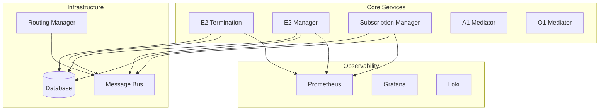

# O-RAN RIC Platform Overview

## Architecture Components

### Core Platform Components
- **E2 Termination (E2T)**: Protocol termination for E2AP messages
- **E2 Manager (E2M)**: E2 node lifecycle management
- **Subscription Manager (SubMgr)**: E2 subscription orchestration
- **A1 Mediator**: Policy management interface
- **O1 Mediator**: Management plane operations
- **xApp Framework**: Application runtime environment

### Supporting Infrastructure
- **Database Service (DBAAS)**: Redis/SDL for state persistence
- **Message Bus (RMR)**: Inter-component communication
- **Routing Manager (RTMGR)**: Message routing configuration

### Observability Stack
- **Prometheus**: Metrics collection and storage
- **Grafana**: Visualization and dashboards
- **Loki**: Log aggregation
- **Jaeger**: Distributed tracing
- **AlertManager**: Alert routing and notification

## Service Dependencies

## Network Interfaces

### Southbound (E2 Interface)
- **Protocol**: E2AP over SCTP
- **Port**: 36422
- **Connections**: E2 nodes (gNB, O-CU, O-DU)

### Northbound (A1 Interface)
- **Protocol**: REST API over HTTPS
- **Port**: 8080/8443
- **Connections**: SMO/Orchestrator

### Management (O1 Interface)
- **Protocol**: NETCONF over SSH/TLS
- **Ports**: 830 (SSH), 6513 (TLS)
- **Connections**: Network Management Systems

## Resource Requirements

### Minimum Production Requirements
- **CPU**: 16 cores
- **Memory**: 32 GB RAM
- **Storage**: 500 GB SSD
- **Network**: 10 Gbps

### Recommended Production Requirements
- **CPU**: 32 cores
- **Memory**: 64 GB RAM
- **Storage**: 1 TB NVMe SSD
- **Network**: 25 Gbps

## Security Considerations

### Authentication
- JWT tokens for API access
- Mutual TLS for inter-component communication
- Certificate-based authentication for E2 nodes

### Authorization
- Role-Based Access Control (RBAC)
- Fine-grained permissions
- Service account management

### Network Security
- TLS 1.3 encryption for all communications
- Network segmentation
- Firewall rules and security groups