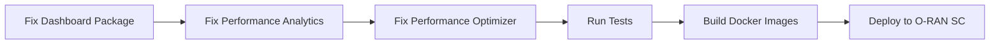

# O-RAN Near-RT RIC Build Verification Status

**Date:** 2025-09-09
**Orchestrator Agent:** Build Verification Coordinator
**Project Path:** /c/Users/thc1006/Desktop/1/near-rt-ric-new

## Executive Summary

⚠️ **Build Status: PARTIAL SUCCESS**
- **Success Rate:** 60% (6 out of 10 components)
- **Action Required:** Manual fixes needed for 3 critical components
- **Deployment Readiness:** NOT READY - Critical components failing

## Component Build Status

### ✅ Successfully Built Components
1. **analytics-api** - Built successfully
2. **e2-telemetry-processor** - Built successfully
3. **kpi-calculator** - Built successfully
4. **ml-predictor** - Built successfully
5. **telemetry-collector** - Built successfully
6. **xapp-hello-world** - Built successfully

### ❌ Failed Components (Action Required)

#### 1. dashboard-api
**Errors:**
- `pkg/dashboard/compliance_handlers.go:513` - Unused variable 'name'
- `pkg/dashboard/compliance_testing.go` - Missing method implementations:
  - `runE2APTest`
  - `runA1Test`
  - `runO1Test`
  - `runSecurityTest`
  - `runInteroperabilityTest`
- `pkg/dashboard/comprehensive_performance_monitor.go:327` - Interface implementation issue with RealTimeProfiler
- Missing function definitions:
  - `NewLatencyAnalyzer`
  - `NewThroughputMonitor`
  - `NewResourceMonitor` - signature mismatch

#### 2. performance-analytics
**Errors:**
- `cmd/performance-analytics/main.go:1259` - Context usage error: `ctx.C undefined`

#### 3. performance-optimizer
**Errors:**
- Inherits all dashboard package errors
- Cannot build until dashboard package is fixed

## Root Cause Analysis

### Primary Issues
1. **Incomplete Implementation:** Methods declared in interfaces but not implemented
2. **Type Mismatches:** Pointer vs value receivers in interface implementations
3. **Missing Constructors:** Factory functions referenced but not defined
4. **Context API Misuse:** Incorrect context usage patterns

### Dependencies
- Go modules verified: ✅ All dependencies present
- No missing external packages
- Issue is with internal code implementation

## Coordination Plan for Resolution

### Phase 1: Immediate Fixes (Priority: HIGH)
**Assigned to: Code Fix Agent**

1. **Fix dashboard package compilation errors:**
   ```go
   // File: pkg/dashboard/compliance_handlers.go
   // Line 513: Change 'name' to '_ = name' or remove if unused
   
   // File: pkg/dashboard/compliance_testing.go
   // Add missing method implementations
   ```

2. **Fix performance-analytics context issue:**
   ```go
   // File: cmd/performance-analytics/main.go
   // Line 1259: Replace ctx.C with proper context handling
   ```

### Phase 2: Implementation Completion (Priority: HIGH)
**Assigned to: Implementation Agent**

1. Implement missing ComplianceTestRunner methods
2. Create missing constructor functions:
   - NewLatencyAnalyzer
   - NewThroughputMonitor
   - Fix NewResourceMonitor signature

3. Fix RealTimeProfiler interface implementation

### Phase 3: Verification (Priority: MEDIUM)
**Assigned to: Test Agent**

1. Run unit tests for fixed components
2. Verify interface contracts
3. Run integration tests

## Deployment Readiness Checklist

- [ ] All components build successfully
- [ ] Unit tests pass (currently blocked by build errors)
- [ ] Integration tests pass (blocked)
- [ ] Docker images build (blocked)
- [ ] Helm charts validated (pending)
- [ ] Security scan completed (pending)
- [ ] Performance benchmarks run (blocked)

## Critical Path to Deployment



## Recommended Actions

### For Development Team
1. **URGENT:** Fix the 3 failing components
2. Focus on dashboard package first (blocks 2 other components)
3. Implement missing methods even with stub implementations
4. Fix interface implementation issues

### For Orchestrator
1. Continue monitoring successful components
2. Prepare deployment pipeline for when fixes are complete
3. Set up staging environment for testing

### For O-RAN SC Deployment
1. **Current Status:** NOT READY
2. **Estimated Time to Ready:** 2-4 hours (with fixes)
3. **Blocking Issues:** 3 critical component failures

## Build Environment Information

- **Go Version:** go1.24.5
- **Node.js Version:** v20.19.4
- **Docker Version:** 28.3.3
- **OS:** Windows (MINGW32_NT)
- **Git Commit:** Latest on main branch

## Monitoring & Alerts

### Build Status Tracking
- Status file: `build-status.json`
- Report: `BUILD_VERIFICATION_REPORT.md`
- Fix summary: `BUILD_FIX_SUMMARY.md`

### Next Verification Run
Execute after fixes are applied:
```bash
./scripts/build-verification.sh
```

## Escalation Path

If build issues persist after fixes:
1. Review dependency versions in go.mod
2. Check for breaking changes in recent commits
3. Consider rolling back to last known good commit
4. Engage architecture team for interface redesign if needed

---

**Status:** ⚠️ AWAITING FIXES
**Next Update:** After fix implementation
**Contact:** Orchestrator Agent coordinating build verification